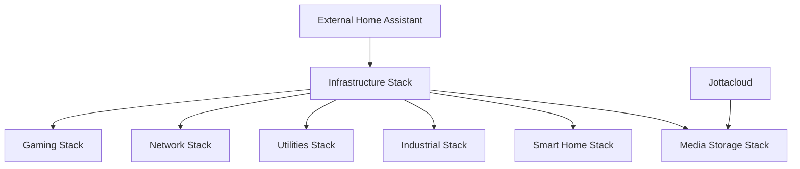

# 🏠 Husserver - Unified Smart Home & Industrial Infrastructure

Modern containerized infrastructure for smart home, industrial automation, media management, and development services. Optimized for resource efficiency with unified database architecture.

## 📋 System Overview

This repository contains Docker Compose configurations for a complete home server setup, consolidating multiple services under a unified infrastructure to minimize resource usage and simplify management.

### 🎯 Design Philosophy
- **Resource Efficiency**: Single MariaDB instance serves multiple applications
- **Centralized Management**: Unified admin tools and monitoring
- **Modular Architecture**: Independent stacks for different service categories
- **External Integration**: Designed to work with external Home Assistant and cloud services

## 🏗️ Infrastructure Components

### **Core Infrastructure**
- **MariaDB 11.4** - Unified database for web applications
- **TimescaleDB pg16** - Time-series database for Home Assistant integration
- **Redis Alpine** - Caching and session storage
- **phpMyAdmin** - MariaDB administration interface
- **pgAdmin** - TimescaleDB administration interface
- **Redis Commander** - Redis management interface

### **Media & Storage**
- **PhotoPrism** - AI-powered photo management and organization
- **Jellyfin** - Media server for movies, TV shows, and music
- **FileBrowser** - Web-based file management interface
- **Jottacloud Sync** - Cloud storage synchronization

### **Smart Home Services**
- **EMQX** - MQTT broker for IoT device communication
- **Scrypted** - Video management and camera integration

### **Industrial Automation**
- **Ignition SCADA** - Industrial automation and HMI platform
- **OPC UA Server** - Industrial communication protocol server
- **Modbus Gateway** - Legacy device integration

### **Development & Utilities**
- **Code Server** - Browser-based VS Code development environment
- **RustDesk** - Self-hosted remote desktop solution
- **Watchtower** - Automatic container updates
- **Dozzle** - Real-time Docker log viewer
- **Uptime Kuma** - Service monitoring and alerting
- **Duplicati** - Automated backup solution

### **Network & Proxy**
- **Nginx Proxy Manager** - Reverse proxy with SSL management
- **Fail2Ban** - Intrusion prevention and security
- **Cloudflared** - Secure tunnel for external access
- **DDNS Updater** - Dynamic DNS management

### **Gaming Servers**
- **Minecraft Creative** - Creative mode server for building
- **Minecraft Survival** - Survival mode server for gameplay
- **Minecraft Friends** - Private server for friends
- **BeamNG.drive MP** - Multiplayer racing server

## 🌐 Service Access Points

| Service | URL | Purpose | Default Credentials |
|---------|-----|---------|-------------------|
| **Database Admin** | | | |
| phpMyAdmin | http://localhost:8787 | MariaDB administration | root / *configured* |
| pgAdmin | http://localhost:5050 | TimescaleDB administration | *configured* |
| Redis Commander | http://localhost:8081 | Redis management | *configured* |
| **Media Services** | | | |
| PhotoPrism | http://localhost:2342 | Photo management | *configured* |
| Jellyfin | http://localhost:8096 | Media streaming | Setup required |
| File Browser | http://localhost:8082 | File management | admin / admin |
| **Smart Home** | | | |
| EMQX Dashboard | http://localhost:18083 | MQTT broker management | *configured* |
| **Industrial** | | | |
| Ignition Gateway | http://localhost:9088 | SCADA platform | *configured* |
| **Development** | | | |
| Code Server | https://localhost:8444 | Web IDE | *configured* |
| Dozzle | http://localhost:8888 | Docker logs | *configured* |
| Uptime Kuma | http://localhost:3001 | Service monitoring | Setup required |
| **Network** | | | |
| Nginx Proxy Manager | http://localhost:81 | Reverse proxy admin | Setup required |
| **Gaming** | | | |
| Minecraft Creative | `localhost:25565` | Game server | Whitelist required |
| Minecraft Survival | `localhost:25566` | Game server | Whitelist required |
| Minecraft Friends | `localhost:25567` | Game server | Whitelist required |
| BeamNG Multiplayer | `localhost:30814` | Game server | - |

## 🗄️ Database Architecture

### **MariaDB Databases**
- `photoprism` - Photo metadata and AI recognition data
- `ignition` - SCADA projects and industrial automation data
- `husserver` - General application data
- `nginxpm` - Nginx Proxy Manager configuration

### **TimescaleDB Databases**
- `homeassistant` - External Home Assistant time-series data
- `prometheus` - Metrics and monitoring data (via Prometheus adapter)

### **External Connections**
Home Assistant running on dedicated hardware connects to:
```yaml
recorder:
  db_url: "postgresql://homeassistant:password@[SERVER_IP]:5432/homeassistant"
```

## 📊 Resource Optimization

### **Consolidated vs. Previous Setup**
- **Database Containers**: 5 → 2 (60% reduction)
- **Memory Usage**: ~1.5GB → ~600MB (900MB saved)
- **Management Complexity**: Multiple separate systems → Unified infrastructure
- **Port Conflicts**: Resolved through proper network isolation
- **Backup Strategy**: Multiple separate → Single coordinated approach

### **Service Dependencies**


## 🔧 Technical Specifications

### **System Requirements**
- **OS**: Linux with Docker and Docker Compose
- **RAM**: Minimum 4GB, recommended 8GB+
- **Storage**: 50GB+ for containers, additional space for media
- **Network**: Static IP recommended for external Home Assistant connection
- **Ports**: See individual compose files for complete port mapping

### **Security Features**
- Environment variable isolation for credentials
- Network segmentation between stacks
- Fail2Ban intrusion prevention
- SSL termination via Nginx Proxy Manager
- Container health monitoring

### **Backup Strategy**
- Database dumps via automated scripts
- Volume snapshots for persistent data
- Jottacloud integration for off-site storage
- Duplicati for comprehensive backup automation

## 📁 Repository Structure

```
husserver/
├── infrastructure/
│   ├── docker-compose.yml
│   ├── init-scripts/
│   └── configs/
├── media-storage/
│   └── docker-compose.yml
├── smart-home/
│   └── docker-compose.yml
├── industrial/
│   └── docker-compose.yml
├── utilities/
│   └── docker-compose.yml
├── network/
│   └── docker-compose.yml
├── gaming/
│   └── docker-compose.yml
├── portainer-configs/
│   ├── infrastructure-env.txt
│   ├── media-env.txt
│   └── [other environment files]
├── docs/
│   ├── INSTALL.md
│   └── TROUBLESHOOTING.md
└── README.md
```

## 🚀 Quick Start

1. **Prerequisites**: Install Docker, Docker Compose, and Portainer
2. **Clone repository**: `git clone [your-repo-url]`
3. **Follow installation guide**: See [INSTALL.md](docs/INSTALL.md) for detailed setup
4. **Configure credentials**: Update environment variables in Portainer
5. **Deploy stacks**: Start with infrastructure, then other services

## 🎯 Use Cases

### **Home Automation**
- MQTT broker for IoT devices
- External Home Assistant database
- Camera management via Scrypted
- Energy monitoring and automation

### **Industrial Applications**
- SCADA systems with Ignition
- OPC UA device communication
- Process monitoring and control
- Industrial data visualization

### **Media Management**
- Photo organization with AI
- Media streaming with Jellyfin
- Cloud storage synchronization
- File management interface

### **Development Environment**
- Browser-based code editing
- Container log monitoring
- Service health monitoring
- Remote access capabilities

### **Gaming & Entertainment**
- Multiple Minecraft servers
- Racing game multiplayer
- Automated server management
- Friend and family access

## 🔗 Integration Points

### **External Home Assistant**
- TimescaleDB connection for recorder
- LTSS (Long Time State Storage) integration
- MQTT broker connection
- Energy data persistence

### **Cloud Services**
- Jottacloud for file synchronization
- Cloudflare for secure external access
- Dynamic DNS for domain management
- External monitoring services

### **Local Network**
- DHCP integration for device discovery
- Network storage access
- VPN compatibility
- Local DNS resolution

## 📚 Documentation

- **[Installation Guide](docs/INSTALL.md)** - Complete setup instructions
- **[Troubleshooting](docs/TROUBLESHOOTING.md)** - Common issues and solutions
- **[Configuration Examples](docs/EXAMPLES.md)** - Sample configurations
- **[Backup & Recovery](docs/BACKUP.md)** - Data protection strategies

## 🤝 Contributing

This is a personal infrastructure setup, but suggestions and improvements are welcome via issues and pull requests.

## 📄 License

This project is provided as-is for educational and personal use.

---

*Last updated: September 2025*  
*Infrastructure version: 2.0 (Optimized)*
